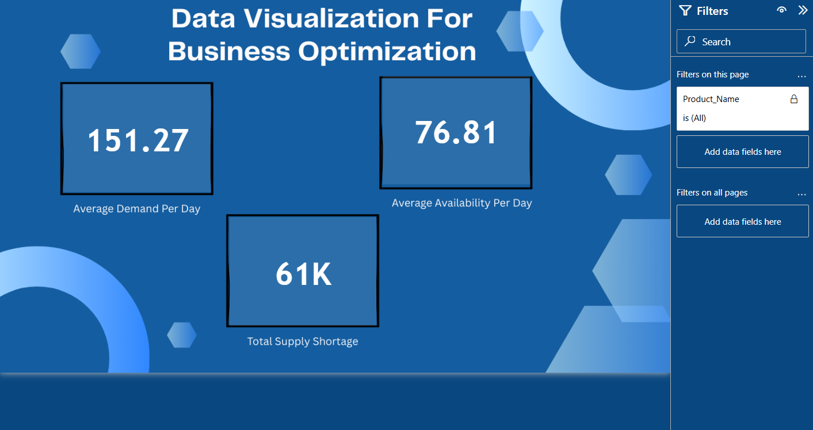
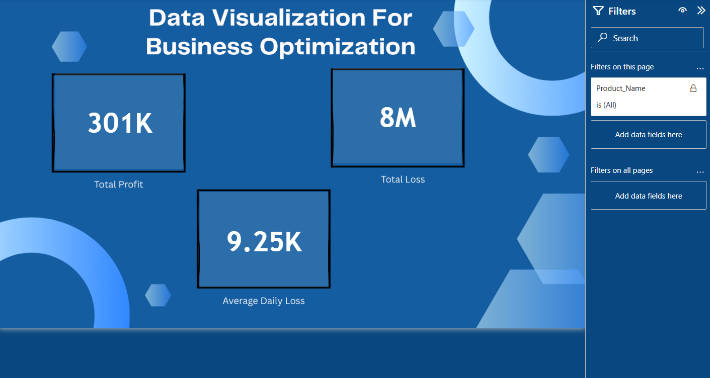
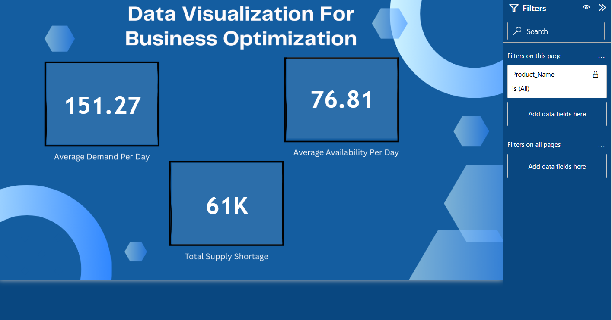

# 📊 Portfolio Project 2 – End-to-End Power BI Report (Datasource: MySQL Database and SQL Server)

This is my second portfolio project where I built a comprehensive Power BI solution integrating **MySQL** and **SQL Server** datasources.  
The project covers data joining, cleaning, KPI reporting, and environment-specific analysis across test and production phases using advanced Power BI features.

---

## 🔗 Table of Contents
- [📘 Project Overview](#-project-overview)
- [📁 Folder Structure](#-folder-structure)
- [📦 Dataset Description](#-dataset-description)
- [📊 Report Features](#-report-features)
- [📸 Dashboard Images](#-dashboard-images)
- [🔗 Reports Link](#-reports-link)
- [🛠️ Tools Used](#️-tools-used)
- [✍️ Author](#-author)

---

## 📘 Project Overview
This project focuses on analyzing inventory data across **test and production environments** by:
- Joining tables from **MySQL** and **SQL Server** in the test phase  
- Cleaning, updating, and validating production data in SQL Server  
- Switching datasource from SQL Server to MySQL for alternative reporting  
- Designing **6 KPIs** for monitoring inventory demand, availability, supply shortages, profit, and loss  
- Creating separate **Power BI workspaces** to handle each environment effectively

---

## 📁 Folder Structure

inventory-environment-analysis/
│
├── 01_Data/
│   ├── Production Environment Inventory Dataset.csv
│   ├── Products.csv
│   └── Test Environment Inventory Dataset.csv
│
├── 02_PowerBI/
│   ├── SQL_Server_Report.pbix
│   └── MySQL_Report.pbix
│
├── 03_Resources/
│   └── Notes.txt   # Jo setup, process, cleanings ki details tum bataoge
│
├── 04_Images/
│   ├── 1.png
│   ├── 2.png
│   ├── 3.png
│   └── 4.png
│
└── README.md

---

## 📦 Dataset Description
The datasets include:
- **Test Environment Dataset** – Combined data from MySQL and SQL Server for KPI calculations  
- **Production Environment Dataset** – Cleaned data from SQL Server used to update reports  
- **Products.csv** – Reference data for inventory items  
The datasets are used to simulate real-world scenarios involving data joins, updates, and environment-specific reporting.

---

## 📊 Report Features
✅ [View MySQL Report](https://app.powerbi.com/links/73k2depm5m?ctid=2556ff83-cdc1-4957-9826-e36f43eedad5&pbi_source=linkShare)  
✅ [View SQL Server Report](https://app.powerbi.com/links/equeuQE4Vh?ctid=2556ff83-cdc1-4957-9826-e36f43eedad5&pbi_source=linkShare)

Key features:
- **6 KPI metrics** to monitor inventory and financial performance:
   • Average Demand per Day  
   • Average Availability per Day  
   • Total Supply Shortage  
   • Total Profit  
   • Total Loss  
   • Average Daily Loss  
- **Data cleaning** in SQL Server (nulls, blanks, updates) for production-ready reporting  
- **Datasource switching** from SQL Server to MySQL to simulate multiple environments  
- **Separate Power BI workspaces** for test and production scenarios  
- Interactive dashboards for monitoring inventory patterns and making data-driven decisions

---

## 📸 Dashboard Images
  

  

  

---

## 🔗 Reports Link
✅ [MySQL Workspace Dashboard](https://app.powerbi.com/links/73k2depm5m?ctid=2556ff83-cdc1-4957-9826-e36f43eedad5&pbi_source=linkShare)  
✅ [SQL Server Workspace Dashboard](https://app.powerbi.com/links/equeuQE4Vh?ctid=2556ff83-cdc1-4957-9826-e36f43eedad5&pbi_source=linkShare)

---

## 🛠️ Tools Used
- **MySQL & SQL Server** – Data storage, joining, cleaning, and updating  
- **Power BI** – Data visualization and reporting  
- **DAX** – Advanced measures for KPI calculations  
- **Dataflow & Workspaces** – Managing environment-specific datasets  
- **Excel (optional)** – Data validation and cross-checking

---

## ✍️ Author
**Gulbaaz**  
DTU’22 | Data & Business Analyst | SQL Server · MySQL · Power BI Projects on GitHub  
📫 [GitHub Profile](https://github.com/Gulbaaz)

